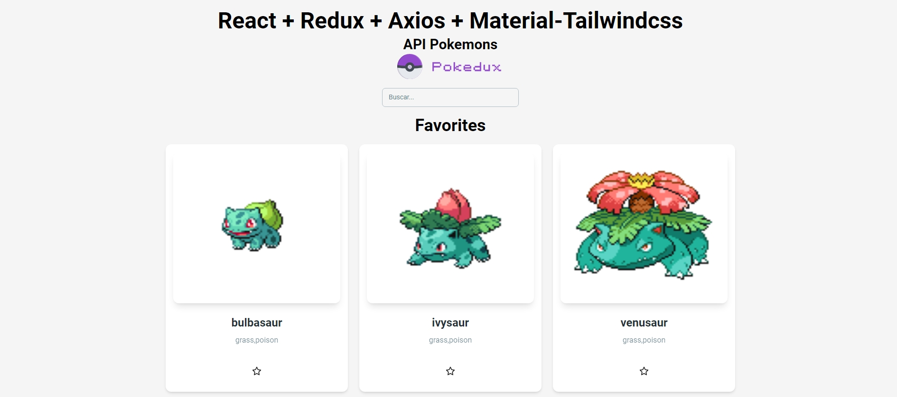

# Proyecto: Pokédex con React

## 1. Demo en Vivo

Puedes ver la aplicación funcionando en el siguiente enlace:

[https://slinkter.github.io/myprojectapi07/](https://slinkter.github.io/myprojectapi07/)



---

## 2. Descripción General

Esta es una aplicación web de página única (SPA) desarrollada con React que consume la PokéAPI para obtener y mostrar una lista de Pokémon. La aplicación permite filtrar los Pokémon en tiempo real, marcarlos como favoritos, navegar por páginas y presenta una interfaz de usuario moderna y reactiva con soporte para tema claro/oscuro.

El proyecto está diseñado siguiendo las mejores prácticas, con un enfoque en un código limpio, escalable y mantenible a través de una arquitectura robusta que combina Redux Toolkit para el estado y hooks personalizados para la lógica de negocio, adhiriéndose estrictamente a los principios SOLID.

---

## 3. Características Principales

-   **Visualización de Pokémon:** Carga y muestra una lista de Pokémon desde la PokéAPI.
-   **Búsqueda en Tiempo Real:** Filtra la lista de Pokémon de forma instantánea a medida que el usuario escribe.
-   **Sistema de Favoritos:** Permite al usuario marcar y desmarcar Pokémon como favoritos. La selección se guarda en `localStorage` para persistir entre sesiones.
-   **Tema Claro/Oscuro:** Permite al usuario cambiar entre un tema claro y uno oscuro. La aplicación detecta la preferencia del sistema operativo en la primera visita y guarda la selección en `localStorage`.
-   **Paginación:** Navegación por páginas para explorar la lista completa de Pokémon de manera eficiente.
-   **Carga Asíncrona Optimizada:** Muestra una animación de "esqueleto" (skeleton) mientras se cargan los datos iniciales.
-   **Manejo de Errores:** Presenta un mensaje de error claro y un botón para reintentar la carga en caso de fallo de la API.
-   **Diseño Responsivo:** La interfaz se adapta correctamente a diferentes tamaños de pantalla, desde móviles hasta escritorio.
-   **Animaciones Sutiles:** Utiliza efectos de transición para una experiencia de usuario más fluida.

---

## 4. Arquitectura y Estructura del Proyecto

La arquitectura de este proyecto se ha diseñado para ser modular, escalable y fácil de mantener, utilizando patrones modernos del ecosistema de React y adhiriéndose estrictamente a los principios SOLID.

### a. Arquitectura Basada en Componentes

La aplicación sigue una **arquitectura basada en componentes**, el pilar de React. Componentes como `PokemonCard`, `PokemonList` y `SearchPokemon` encapsulan partes específicas de la UI, haciéndolos reutilizables y fáciles de probar de forma aislada.

### b. Patrón Contenedor/Presentacional (Modernizado con Hooks)

Se aplica una versión moderna del patrón **Contenedor/Presentacional**. 
-   **Componente Contenedor:** `App.jsx` actúa como el orquestador principal. No contiene lógica de estado compleja directamente, sino que utiliza múltiples hooks para obtener los datos y las funciones necesarias, componiendo el estado final.
-   **Componentes Presentacionales:** La mayoría de los componentes (`PokemonList`, `PokemonCard`) son "visuales". Reciben datos y funciones a través de props y se encargan únicamente de renderizar la UI. No interactúan directamente con el estado global.

### c. Gestión de Estado Centralizada con Redux Toolkit

Para el manejo del estado global, se eligió **Redux Toolkit**, la herramienta estándar de la industria para aplicaciones React robustas.
-   **Justificación de la Elección:** Redux Toolkit proporciona un `store` predecible y centralizado, ideal para manejar estados complejos. Las **Redux DevTools** facilitan enormemente la depuración. Su integración con `createAsyncThunk` ofrece una forma estandarizada y robusta de manejar llamadas a APIs.
-   **Slices Dedicados:** Para una estricta adherencia al SRP, el estado se ha dividido en slices con responsabilidades únicas:
    -   `pokemonSlice.js`: Gestiona exclusivamente la carga, paginación y el estado de la lista de Pokémon desde la API.
    -   `searchSlice.js`: Gestiona únicamente el filtro de búsqueda.
    -   `favoritesSlice.js`: Gestiona los IDs de los Pokémon favoritos y su persistencia en `localStorage`.
    -   `themeSlice.js`: Gestiona el tema actual (claro/oscuro) y su persistencia.

### d. Hooks Personalizados para Abstraer la Lógica

Se han creado hooks personalizados en `src/hooks` para encapsular y reutilizar la lógica de negocio, manteniendo los componentes limpios y centrados en la UI. Cada hook se alinea con la responsabilidad de su slice correspondiente:
-   `usePokemon.js`: Proporciona la lista de Pokémon en bruto, el estado de carga, paginación y la función para obtenerlos.
-   `useSearch.js`: Proporciona el filtro de búsqueda actual y la función para actualizarlo.
-   `useFavorites.js`: Proporciona los IDs de los Pokémon favoritos y la función para alternar su estado.
-   `useTheme.js`: Proporciona el tema actual y la función para alternarlo, aplicando la clase `dark` al `documentElement`.

### e. Aplicación de Principios SOLID

La refactorización del proyecto se ha realizado con una estricta adherencia a los principios SOLID, lo que resulta en un código más modular, mantenible y escalable.

1.  **S - Single Responsibility Principle (SRP):**
    -   **Evidencia:** Cada slice de Redux (`pokemonSlice`, `searchSlice`, `favoritesSlice`, `themeSlice`) tiene una única razón para cambiar. De manera similar, los hooks personalizados y los componentes de presentación tienen responsabilidades bien definidas.
    -   **Beneficio:** Facilita el mantenimiento y reduce el riesgo de efectos secundarios al modificar una parte del sistema.

2.  **O - Open/Closed Principle (OCP):**
    -   **Evidencia:** El sistema está abierto a la extensión pero cerrado a la modificación. Por ejemplo, si se desea añadir una nueva funcionalidad (ej. ordenar Pokémon), se puede crear un nuevo `sortSlice` y `useSort` sin necesidad de modificar los slices o hooks existentes. `App.jsx` simplemente compondría esta nueva abstracción.
    -   **Beneficio:** Permite añadir nuevas características con un impacto mínimo en el código existente, promoviendo la estabilidad.

3.  **I - Interface Segregation Principle (ISP):**
    -   **Evidencia:** Los componentes no se ven forzados a depender de interfaces que no utilizan. `SearchPokemon` solo consume el hook `useSearch`. `PokemonCard` solo interactúa con `useFavorites`. `App.jsx` compone las interfaces necesarias de múltiples hooks.
    -   **Beneficio:** Reduce el acoplamiento entre componentes y abstracciones, haciendo el código más legible y fácil de entender.

4.  **D - Dependency Inversion Principle (DIP):**
    -   **Evidencia:** Los módulos de alto nivel (`App.jsx`) no dependen de los detalles de implementación de bajo nivel (los slices de Redux). En su lugar, `App.jsx` depende de abstracciones (los hooks personalizados). Si la implementación subyacente de Redux cambiara, solo los hooks y slices tendrían que adaptarse, mientras que `App.jsx` permanecería inalterado siempre que las interfaces de los hooks se mantengan.
    -   **Beneficio:** Aumenta la flexibilidad del sistema y facilita la sustitución de módulos de bajo nivel sin afectar a los de alto nivel.

---

## 5. Tecnologías Utilizadas

-   **React 18:** Para la construcción de la interfaz de usuario.
-   **Vite:** Como herramienta de empaquetado y servidor de desarrollo de alta velocidad.
-   **Redux Toolkit:** Para la gestión del estado global de la aplicación.
-   **React Redux:** Para conectar los componentes de React con el store de Redux.
-   **Axios:** Para realizar las peticiones HTTP a la PokéAPI.
-   **Tailwind CSS:** Para un desarrollo de estilos rápido y personalizable mediante clases de utilidad, con configuración extendida para colores y fuentes.
-   **Material-UI (MUI):** Utilizado para componentes de layout y UI como `AppBar`, `Container` y `Grid`, combinando la robustez de MUI con la flexibilidad de Tailwind.
-   **Heroicons:** Para iconos utilizados en la interfaz de usuario (ej. tema claro/oscuro, paginación).
-   **ESLint:** Para mantener un código limpio, consistente y libre de errores.

---

## 6. Optimizaciones de Rendimiento y UX

1.  **Memoización con `useMemo` y `useCallback`**: En `App.jsx` y otros hooks, se utiliza `useMemo` para calcular listas y `useCallback` para funciones, asegurando que los cálculos costosos solo se re-ejecuten si las dependencias relevantes cambian, evitando re-renderizados innecesarios.
2.  **Carga Diferida de Imágenes (`loading="lazy"`)**: Las imágenes de los Pokémon en `PokemonCard` utilizan el atributo `loading="lazy"` del navegador para que solo se descarguen cuando están a punto de entrar en el viewport, mejorando el tiempo de carga inicial.
3.  **Estado de Carga Visual (`Skeleton`)**: Se muestra un componente `PokemonSkeleton` mientras se espera la respuesta de la API, mejorando la experiencia de usuario al proporcionar feedback visual inmediato.
4.  **Persistencia de Favoritos y Tema**: El uso de `localStorage` para guardar los favoritos y la preferencia de tema asegura que las preferencias del usuario no se pierdan al recargar la página.
5.  **Manejo de Errores con Feedback Visual**: Se proporciona un mensaje de error claro y una opción para reintentar la carga en caso de fallos de la API, mejorando la resiliencia de la aplicación.
6.  **Paginación Eficiente**: La implementación de paginación reduce la cantidad de datos cargados inicialmente, mejorando el rendimiento y la navegación en grandes conjuntos de datos.

---

## 7. Estructura de Archivos y Roles

```
/src
├── app/
│   └── App.jsx              # Componente principal que orquesta la aplicación, componiendo el estado de múltiples hooks.
├── assets/
│   └── logo.svg             # Assets estáticos como el logo.
├── components/
│   ├── pokemon/
│   │   ├── PokemonCard.jsx  # Tarjeta para mostrar un Pokémon.
│   │   └── PokemonList.jsx  # Muestra la lista de tarjetas de Pokémon.
│   ├── ui/
│   │   └── PokemonSkeleton.jsx # Componente de carga (esqueleto).
│   └── SearchPokemon.jsx      # Input de búsqueda.
├── features/
│   ├── favorites/
│   │   └── favoritesSlice.js  # Slice de Redux para la gestión de favoritos y persistencia.
│   ├── pokemon/
│   │   └── pokemonSlice.js  # Slice de Redux para la carga, paginación y estado de la lista de Pokémon.
│   ├── search/
│   │   └── searchSlice.js     # Slice de Redux para la gestión del filtro de búsqueda.
│   └── theme/
│       └── themeSlice.js      # Slice de Redux para la gestión del tema (claro/oscuro) y persistencia.
├── hooks/
│   ├── useFavorites.js      # Hook para interactuar con el estado de favoritos.
│   ├── usePokemon.js        # Hook para interactuar con el estado de la lista de Pokémon y paginación.
│   ├── useSearch.js         # Hook para interactuar con el estado del filtro de búsqueda.
│   └── useTheme.js          # Hook para interactuar con el estado del tema y aplicar clases CSS.
├── services/
│   └── api/
│       ├── config.js        # Configuración de la API (URLs, etc.).
│       └── pokemon.js       # Funciones para hacer llamadas a la PokéAPI con soporte de paginación.
├── store/
│   └── index.js             # Configura y combina los reducers para el store de Redux.
├── main.jsx                 # Punto de entrada de la aplicación. Renderiza App y provee el store.
└── index.css                # Estilos globales, capas base y componentes de Tailwind.
```

---

## 8. Cómo Ejecutar el Proyecto Localmente

1.  Clona el repositorio:

    ```bash
    git clone https://github.com/Slinkter/myprojectapi07.git
    cd myprojectapi07
    ```

2.  Instala las dependencias (se recomienda `pnpm` o `npm`):

    ```bash
    npm install
    ```

3.  Inicia el servidor de desarrollo:

    ```bash
    npm run dev
    ```

4.  Abre http://localhost:5173 (o el puerto que indique Vite) en tu navegador.

### Scripts Disponibles

-   `npm run dev`: Inicia el servidor de desarrollo.
-   `npm run build`: Compila la aplicación para producción.
-   `npm run preview`: Previsualiza la build de producción localmente.
-   `npm run deploy`: Despliega la aplicación en GitHub Pages.