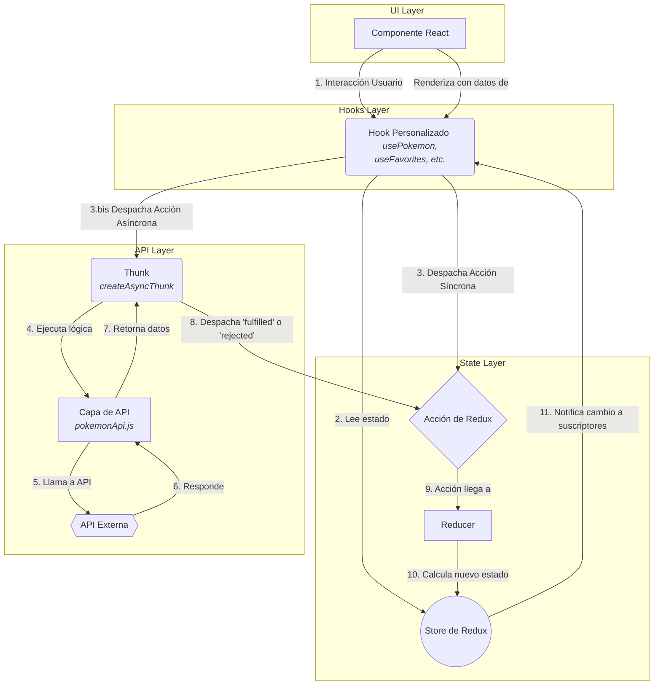
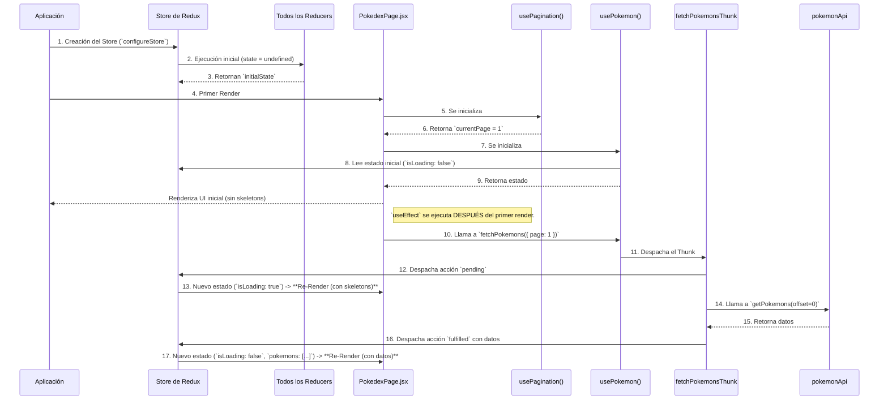
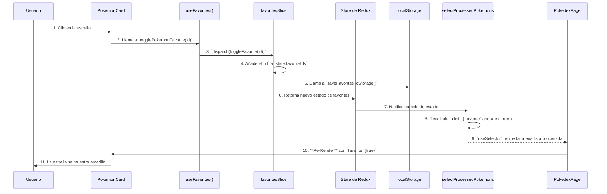

# Documento Técnico de Flujo de Datos (Data Flow)

## 1. Introducción

Este documento detalla la arquitectura de flujo de datos de la aplicación Pokédex. Su propósito es servir como una guía técnica para desarrolladores, líderes técnicos y evaluadores, explicando cómo fluye la información y el estado a través de las diferentes capas de la aplicación, desde la interacción del usuario hasta la comunicación con la API.

El análisis se centra en el ciclo de vida del estado, gestionado con **Redux Toolkit**, y la interacción con los componentes de **React**.

## 2. Arquitectura General

La aplicación sigue un patrón arquitectónico moderno, escalable y mantenible basado en las siguientes características:

*   **Arquitectura por Features (Feature-Based):** El código está organizado en carpetas por funcionalidad (`pokemon`, `favorites`, `search`, `theme`), no por tipo de archivo. Cada feature encapsula sus propios componentes, hooks y lógica de estado.
*   **Fuente Única de Verdad (Single Source of Truth):** **Redux Toolkit** se utiliza para gestionar todo el estado global de la aplicación. El `store` de Redux es la única fuente de verdad.
*   **UI Declarativa:** **React** se utiliza para construir la interfaz de usuario. Los componentes reaccionan a los cambios en el estado de Redux y se renderizan de nuevo cuando los datos que consumen cambian.
*   **Patrón Fachada (Facade Pattern) con Hooks:** Se utilizan hooks personalizados (ej. `usePokemon`, `useFavorites`) como una fachada que abstrae la interacción con Redux. Los componentes no interactúan directamente con `useSelector` o `useDispatch`; en su lugar, utilizan estos hooks, lo que los desacopla de la implementación del estado.
*   **Componentes Contenedores y de Presentación:** Las "Páginas" (ej. `PokedexPage`) actúan como componentes contenedores (Orquestadores) que obtienen datos y coordinan la lógica, mientras que los componentes de UI (ej. `PokemonCard`, `PokemonList`) son componentes de presentación "tontos" que solo reciben datos y los renderizan.
*   **Manejo de Asincronía:** Las operaciones asíncronas, como las llamadas a la API, se gestionan con **Thunks** de Redux (`createAsyncThunk`).

## 3. Diagrama de Data Flow Global

Este diagrama ilustra el flujo de datos general en la aplicación.

## 4. Casos de Uso Documentados

### 📌 CASO 1: Carga Inicial de la Aplicación

Este flujo describe lo que sucede desde que el usuario abre la aplicación hasta que ve la primera lista de Pokémon.

**Diagrama de Secuencia:**

**Explicación Paso a Paso:**

1.  **Inicialización del Store:** Al arrancar la aplicación, `configureStore` crea el store de Redux. Inmediatamente, ejecuta cada reducer una vez con un estado `undefined` para poblar el store con sus respectivos `initialState`.
2.  **Primer Render:** `PokedexPage` se renderiza. Llama a `usePagination`, que lee la URL, no encuentra el parámetro `page`, y establece `currentPage` en `1` por defecto. Luego llama a `usePokemon`, que usa `useSelector` para leer el estado inicial del store (`isLoading` es `false`).
3.  **Ejecución de `useEffect`:** Después de que la UI inicial se ha pintado en la pantalla, React ejecuta el `useEffect` en `PokedexPage`. Este efecto llama a la función `fetchPokemons` (del hook `usePokemon`) con la `currentPage` (que es `1`).
4.  **Estado de Carga:** La función `fetchPokemons` despacha el `fetchPokemonsThunk`. Esto inmediatamente dispara la acción `pending`. El `pokemonReducer` la recibe y actualiza el estado a `isLoading: true`. Este cambio provoca un **segundo renderizado** de `PokedexPage`, que ahora muestra los `PokemonSkeleton`.
5.  **Llamada a la API:** Mientras se muestra el estado de carga, el `Thunk` ejecuta la llamada a la API a través de `pokemonApi.js`. El `offset` se calcula como `(1 - 1) * 20 = 0`.
6.  **Estado de Éxito:** La API responde con éxito. El `Thunk` despacha la acción `fulfilled` con los datos de los Pokémon como `payload`.
7.  **Estado Final:** El `pokemonReducer` recibe la acción `fulfilled`, actualiza el estado con `isLoading: false` y la lista de `pokemons`. Esto provoca un **tercer renderizado** de `PokedexPage`, que finalmente muestra la `PokemonList` con los datos cargados.

### 📌 CASO 2: Usuario Marca un Pokémon como Favorito

Este flujo describe la reacción en cadena cuando un usuario hace clic en el ícono de estrella en una `PokemonCard`.

**Diagrama de Secuencia:**

**Explicación Paso a Paso:**

1.  **Evento `onClick`:** El usuario hace clic en el botón de estrella en `PokemonCard`. Se ejecuta el manejador `handleFavoriteClick`.
2.  **Llamada al Hook:** El manejador llama a `togglePokemonFavorite(id)`, una función proporcionada por el hook `useFavorites`.
3.  **Dispatch de la Acción:** El hook `useFavorites` despacha la acción `toggleFavorite` con el `id` del Pokémon como `payload`.
4.  **Actualización del Reducer:** El `favoritesReducer` recibe la acción. Como el `id` no está en el array `favoriteIds`, lo añade.
5.  **Persistencia (Efecto Secundario):** Inmediatamente después de modificar el estado, el reducer llama a `saveFavoritesToStorage()` para guardar el nuevo array de favoritos en `localStorage`.
6.  **Actualización del Store:** El reducer devuelve el nuevo estado y el store de Redux se actualiza.
7.  **Re-cálculo del Selector:** El cambio en `state.favorites` provoca que el selector memoizado `selectProcessedPokemons` se vuelva a ejecutar. Este selector ahora combina la lista de Pokémon con la nueva lista de favoritos y marca al Pokémon correspondiente con `favorite: true`.
8.  **Re-render del Componente:** `PokedexPage` está suscrito a los resultados de `selectProcessedPokemons` a través de `useSelector`. Al recibir la nueva lista procesada, se vuelve a renderizar, pasando la prop `favorite={true}` a la `PokemonCard` correspondiente, que actualiza su estilo para mostrar la estrella coloreada.

### 📌 CASO 3: Usuario Elimina un Favorito

El flujo es idéntico al **Caso 2**, pero con una lógica inversa en el reducer:

1.  El usuario hace clic en una estrella ya marcada como favorita.
2.  Se despacha la misma acción `toggleFavorite(id)`.
3.  Esta vez, el `favoritesReducer` detecta que el `id` **ya existe** en el array `favoriteIds`.
4.  En lugar de añadir, utiliza `.filter()` para crear un nuevo array que excluye ese `id`.
5.  El resto del flujo (persistencia en `localStorage`, actualización del store, re-cálculo del selector y re-render) es exactamente el mismo.

### 📌 CASO 4: Error en la API

Este flujo describe qué sucede si la llamada a la API falla durante la carga de Pokémon.

**Explicación Paso a Paso:**

1.  El flujo comienza igual que el **Caso 1**, con el `useEffect` despachando el `fetchPokemonsThunk`.
2.  **Fallo de la API:** La llamada a `pokemonApi.getPokemons()` falla (ej. error de red, la API devuelve un status 500). La promesa es rechazada.
3.  **Catch del Thunk:** El bloque `catch` dentro del `createAsyncThunk` se ejecuta. Llama a `rejectWithValue(error.message)`, lo que hace que el `Thunk` despache la acción `rejected`.
4.  **Actualización del Reducer de Error:** El `pokemonReducer` recibe la acción `rejected`. Actualiza el estado a `{ isLoading: false, isError: true, error: "Mensaje de error" }`.
5.  **Re-render con UI de Error:** El cambio de estado provoca que `PokedexPage` se vuelva a renderizar. El hook `usePokemon` ahora devuelve `isError: true` y el mensaje de `error`. Estos props se pasan al componente `PokemonContent`.
6.  **Renderizado Condicional:** Dentro de `PokemonContent`, la primera condición `if (error)` ahora es verdadera, por lo que renderiza la UI de error, mostrando el mensaje y el botón de "Reintentar".
7.  **Reintento:** Si el usuario hace clic en "Reintentar", se invoca la prop `onRetry`, que en `PokedexPage` está conectada a `() => fetchPokemons({ page: currentPage })`, reiniciando el ciclo de carga de datos.

## 5. Tabla Resumen de Estados

| Clave de Estado | Slice | Propósito |
| :--- | :--- | :--- |
| `pokemons` | `pokemon` | Almacena la lista cruda de Pokémon de la página actual. |
| `isLoading` | `pokemon` | `true` si una petición a la API está en curso. |
| `isError` | `pokemon` | `true` si la última petición a la API falló. |
| `error` | `pokemon` | Contiene el mensaje de error de la API. |
| `totalCount` | `pokemon` | Número total de Pokémon disponibles en la API, para la paginación. |
| `favoriteIds` | `favorites` | Array de IDs numéricos de los Pokémon marcados como favoritos. |
| `searchFilter`| `search` | String del término de búsqueda introducido por el usuario. |
| `currentTheme`| `theme` | String que indica el tema actual (`'light'` o `'dark'`). |

## 6. Glosario Técnico

*   **Slice:** Una porción del estado de Redux que agrupa sus `reducers` y `actions` relacionados. Creado con `createSlice`.
*   **Reducer:** Una función pura que toma el estado actual y una acción, y devuelve el siguiente estado.
*   **Thunk:** Una función que envuelve una lógica asíncrona (como una llamada a la API) y puede despachar acciones regulares (`pending`, `fulfilled`, `rejected`).
*   **Selector Memoizado:** Una función creada con `createSelector` que calcula datos derivados del estado. Solo se vuelve a calcular si sus entradas cambian, optimizando el rendimiento y evitando re-renders innecesarios.
*   **Hook Fachada (Facade Hook):** Un hook personalizado que abstrae la interacción con una librería o una lógica compleja (en este caso, Redux), proporcionando una API más simple y semántica a los componentes.

## 7. Conclusión y Recomendaciones

### Conclusión Técnica

La arquitectura de la aplicación es **sólida, moderna y escalable**. El flujo de datos es unidireccional y predecible, siguiendo las mejores prácticas del ecosistema React/Redux. Las fortalezas clave son:

*   **Separación de Responsabilidades:** Clara distinción entre la lógica de estado (Redux), la lógica de UI (React) y la lógica de API.
*   **Desacoplamiento:** El uso de hooks como fachada desacopla eficazmente los componentes de la implementación de Redux.
*   **Optimización:** El uso de selectores memoizados (`selectProcessedPokemons`) es crucial para el rendimiento, evitando cálculos costosos en cada render.

### Recomendaciones de Mejora (Sin Tocar Código)

La arquitectura actual es muy robusta. Una posible mejora para una implementación aún más "pura" de Redux sería la siguiente:

*   **Extraer Efectos Secundarios de los Reducers:** Actualmente, los `reducers` de `favoritesSlice` y `themeSlice` llaman directamente a `localStorage.setItem()`. Esto es un "efecto secundario" (side effect). En una arquitectura Redux estricta, los reducers deben ser funciones puras.
    *   **Solución Propuesta:** Implementar un **middleware de Redux personalizado**. Este middleware podría escuchar acciones específicas (como `toggleFavorite` o `toggleTheme`) y, después de que la acción haya pasado por el reducer, ejecutar la escritura en `localStorage`. Esto mantendría los reducers 100% puros y centralizaría la lógica de persistencia. Sin embargo, para la escala de este proyecto, la solución actual es pragmática y perfectamente funcional.
