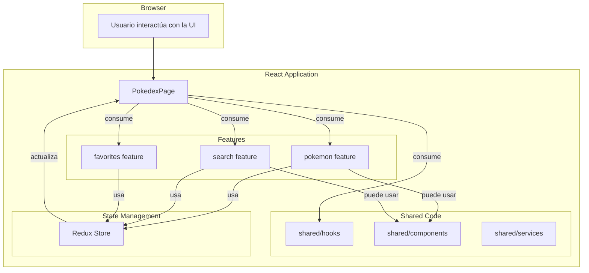
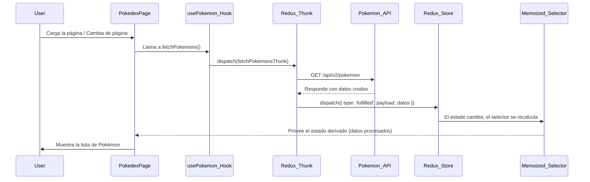

# 🏛️ Arquitectura y Diseño de Software

Este documento proporciona una visión general detallada de la arquitectura de la aplicación **Pokédex API 07**, las decisiones de diseño clave y los patrones implementados.

---

## 1. Patrón de Arquitectura Principal: Feature-Based

La aplicación está estructurada siguiendo una **Arquitectura Basada en Funcionalidades (Feature-Based Architecture)**. Este enfoque organiza el código en módulos que representan las diferentes funcionalidades o dominios de la aplicación, en lugar de agruparlo por tipo de archivo (como `components`, `hooks`, etc.) en carpetas globales.

**Ventajas de este enfoque:**
-   **Alta Cohesión:** Todo lo relacionado con una funcionalidad (UI, lógica, estado, servicios) se encuentra en un solo lugar.
-   **Bajo Acoplamiento:** Las funcionalidades son independientes entre sí y se comunican a través de interfaces bien definidas (hooks, estado de Redux).
-   **Escalabilidad:** Añadir o modificar una funcionalidad tiene un impacto mínimo en el resto de la aplicación.

La estructura de directorios refleja este patrón:

```
src/
 ├── features/            # Módulos de funcionalidades
 │   ├── pokemon/
 │   ├── search/
 │   └── favorites/
 ├── shared/              # Código reutilizable no específico de una feature
 │   ├── hooks/
 │   └── components/
 ├── pages/               # Orquestadores de UI
 └── ...
```

## 2. Diagrama de Arquitectura de Componentes

El siguiente diagrama ilustra la relación entre las capas de la aplicación: `pages`, `features`, y `shared`.



-   **`PokedexPage` (Capa de Orquestación):** Actúa como un "contenedor" principal. No tiene lógica de negocio propia. Su única función es consumir los hooks de las diferentes `features` y del código `shared` para obtener datos y estado, y luego pasarlos a los componentes de presentación.
-   **`features` (Capa de Funcionalidad):** Cada `feature` expone uno o más hooks que sirven como su API pública. Por ejemplo, `usePokemon()` expone los datos de los Pokémon y la función para cargarlos. Internamente, la `feature` puede gestionar su propio estado de Redux y su lógica.
-   **`shared` (Capa de Reutilización):** Proporciona elementos genéricos. `usePagination` es un ejemplo clave: un hook reutilizable que puede ser consumido por cualquier página que necesite paginación.

## 3. Flujo de Datos (Data Flow)

El flujo de datos en la aplicación es **unidireccional**, una de las características fundamentales de React y Redux.

**Ciclo de Flujo de Datos Típico (Cargar Pokémon):**

1.  El componente `PokedexPage` se renderiza.
2.  El `useEffect` en `PokedexPage` detecta un cambio en `currentPage` (obtenido del hook `usePagination`).
3.  Llama a la función `fetchPokemons()` (obtenida del hook `usePokemon`).
4.  `fetchPokemons()` despacha un **thunk asíncrono** (`fetchPokemonsThunk`).
5.  El thunk realiza la llamada a la API a través del servicio `pokemonApi`.
6.  La API devuelve los datos crudos.
7.  El thunk despacha una acción de Redux (`fulfilled`) con los datos recibidos.
8.  El `pokemonSlice` (reducer) intercepta la acción y actualiza su estado en el **Store de Redux**.
9.  React-Redux detecta un cambio en el estado del store.
10. Un **selector memoizado** (`selectProcessedPokemons`) que está suscrito a los cambios del estado, se recalcula. Combina los datos de `pokemonSlice`, `favoritesSlice` y `searchSlice` para crear la lista final de Pokémon a mostrar.
11. El componente `PokedexPage`, que está suscrito al selector a través de `useSelector`, recibe los nuevos datos ya procesados y se vuelve a renderizar.
12. La UI muestra la lista de Pokémon actualizada.

El siguiente diagrama de secuencia ilustra este flujo:



## 4. Manejo de Estado

El estado se divide en dos categorías principales:

-   **Estado Global:** Gestionado por **Redux Toolkit**. Es para datos que son accedidos o modificados por múltiples componentes en diferentes partes del árbol de la aplicación. Ejemplos: la lista de Pokémon, el ID de los favoritos, el término de búsqueda, el tema (claro/oscuro).
-   **Estado Local:** Gestionado con `useState` o `useReducer` de React. Es para datos que solo son relevantes para un único componente o un pequeño subárbol de componentes. Ejemplo: el estado de si un menú desplegable está abierto o cerrado.

Esta división asegura que no se sature el store de Redux con estado que no necesita ser global, mejorando el rendimiento y la mantenibilidad.