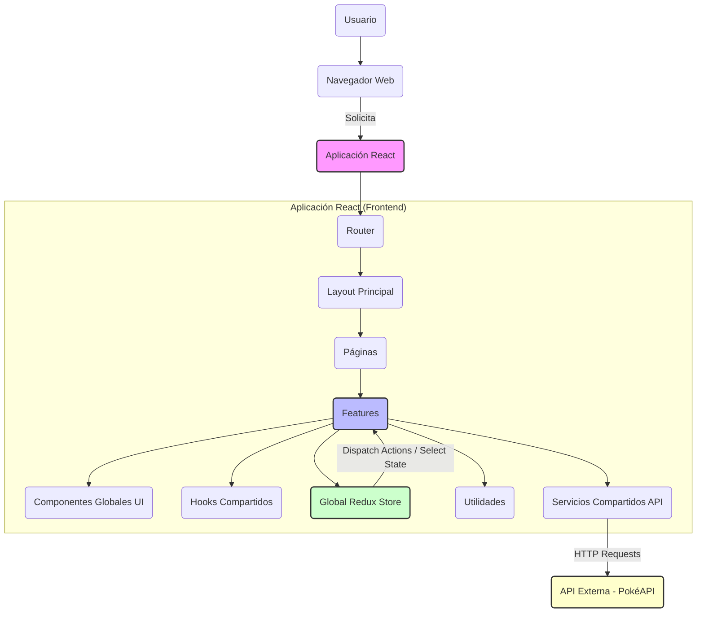
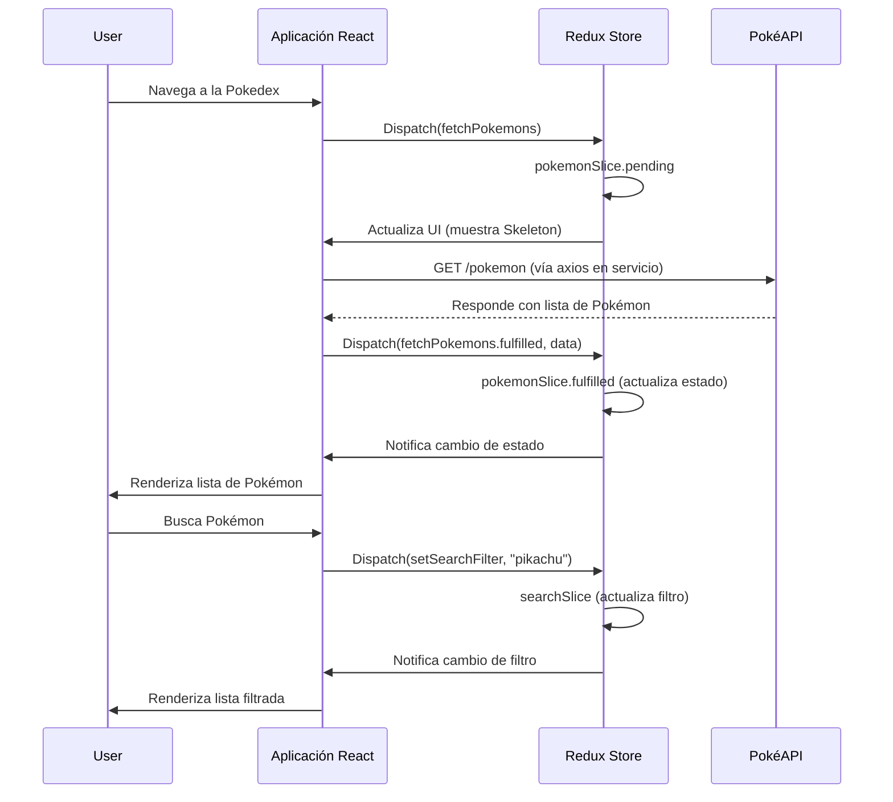

# Arquitectura General del Proyecto

Este documento presenta una visión de alto nivel de la arquitectura de la aplicación `myprojectapi07`, sus componentes principales y cómo interactúan para cumplir con los requerimientos. La arquitectura se basa en principios de modularidad, separación de responsabilidades y escalabilidad.

---

## 1. Visión General y Principios

La arquitectura del Frontend está diseñada para ser:
*   **Modular:** Dividida en unidades autocontenidas (features).
*   **Desacoplada:** Componentes y módulos con mínima dependencia entre sí.
*   **Escalable:** Fácil de expandir con nuevas funcionalidades sin refactorizar extensivamente el código existente.
*   **Testable:** Componentes y lógica aislados para facilitar las pruebas unitarias y de integración.

### Principios Fundamentales

*   **Feature-Based Architecture:** El código se organiza por funcionalidades de negocio, agrupando todo lo relacionado con una feature específica.
*   **Container/Presentation Pattern:** Clara división entre componentes que gestionan la lógica de negocio y estado (Containers) y componentes que se encargan solo de la UI (Presentation).
*   **Single Responsibility Principle (SRP):** Cada módulo, componente o función debe tener una única razón para cambiar.
*   **DRY (Don't Repeat Yourself):** Evitar la duplicación de código.

## 2. Diagrama de Arquitectura de Alto Nivel



**Descripción del Diagrama:**
El usuario interactúa con la aplicación a través del navegador. La aplicación React utiliza un Router para navegar entre Páginas y, a su vez, estas páginas componen diversas Features. Las Features son el núcleo lógico, interactuando con el Redux Store global, Hooks compartidos, Componentes UI globales, Utilidades y Servicios de API. Estos Servicios de API se comunican con la API Externa.

## 3. Estructura de Directorios

La organización del código refleja directamente esta arquitectura, facilitando la localización de los elementos y la comprensión de sus responsabilidades.

```
src/
 ├─ app/                 # Configuración principal de la aplicación
 ├─ assets/              # Recursos estáticos (imágenes, iconos)
 ├─ components/          # Componentes de UI agnósticos al negocio (compartidos)
 │  ├─ layout/           # Componentes de layout (Header, Footer, MainLayout)
 │  └─ ui/               # Componentes UI atómicos (Button, Card, Spinner)
 ├─ docs/                # Toda la documentación del proyecto
 ├─ features/            # Módulos autocontenidos por funcionalidad de negocio
 │  └─ [feature-name]/   # Ej: pokemon-list, favorites, search
 │     ├─ api/           # Servicios de API específicos de la feature
 │     ├─ components/    # Componentes UI específicos de la feature
 │     ├─ containers/    # Contenedores (lógica de negocio y estado)
 │     ├─ hooks/         # Custom Hooks específicos de la feature
 │     ├─ tests/         # Tests de la feature
 │     └─ index.js       # Exportaciones principales y slice de Redux (si aplica)
 ├─ hooks/               # Custom Hooks reutilizables sin lógica de negocio
 ├─ lib/                 # Instancias o configuraciones de librerías externas
 ├─ pages/               # Ensambla features y componentes para formar una página completa
 ├─ providers/           # Context Providers globales (Theme, Auth, etc.)
 ├─ routes/              # Definición de rutas de la aplicación
 ├─ services/            # Servicios de API globales o transversales (ej. config de Axios)
 ├─ store/               # Configuración del store de Redux
 └─ utils/               # Funciones de utilidad puras y compartidas
```

## 4. Flujo de Datos Principal



**Descripción del Flujo de Datos:**
Este diagrama de secuencia ilustra el flujo típico de datos para la carga y filtrado de Pokémon, utilizando Redux para la gestión del estado global y la comunicación con la API.

## 5. Gestión del Estado (Redux Toolkit)

Redux Toolkit es la herramienta elegida para la gestión del estado global. Cada **feature** que requiera estado global tendrá su propio "slice" de Redux, encapsulando sus `reducer` y `actions`. El `store` central (`src/store/index.js`) combinará estos slices.

## 6. Integración con la API (Axios)

Las interacciones con APIs externas se gestionan a través de `Axios`. Se utiliza una configuración centralizada de `Axios` (`src/lib/axios.js`) y servicios específicos por feature (`src/features/[feature-name]/api/`) para encapsular las llamadas y el manejo de errores.

---
*Este documento es generado y mantenido automáticamente como parte de la documentación del proyecto.*
