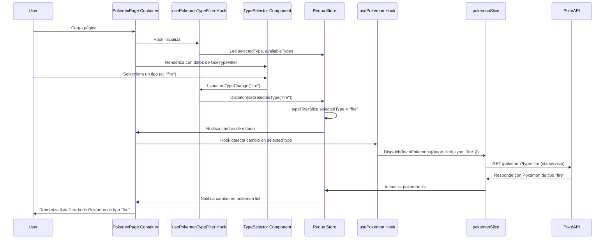

# Tutorial Completo de Desarrollo: Añadiendo una Nueva Feature 'Pokémon por Tipo'

Este tutorial te guiará paso a paso a través del proceso de añadir una nueva funcionalidad (`feature`) a la aplicación `myprojectapi07`, aplicando la **Arquitectura Basada en Features**, el patrón **Container/Presentation**, Custom Hooks, Redux Toolkit y las convenciones de código establecidas.

---

## 1. Objetivo del Tutorial

Implementar una nueva feature que permita al usuario filtrar los Pokémon por tipo (ej. "Fire", "Water", "Grass"). Esto incluirá:
*   Un nuevo selector de tipo en la UI.
*   Modificación de la lógica de fetch de Pokémon para incluir el filtro por tipo.
*   Actualización del estado global para gestionar el tipo seleccionado.

## 2. Preparación

Asegúrate de tener el entorno de desarrollo configurado y la aplicación ejecutándose.

1.  Clona el repositorio si no lo has hecho: `git clone [URL_DEL_REPOSITORIO]`
2.  Navega al directorio del proyecto: `cd myprojectapi07`
3.  Instala las dependencias: `pnpm install`
4.  Inicia la aplicación en modo desarrollo: `pnpm run dev`

## 3. Fase 1: Planificación de la Feature

### 3.1. Definir la Estructura de la Feature `pokemon-type-filter`

Siguiendo la **Feature-Based Architecture**, crearemos un nuevo directorio para nuestra feature:

```
src/features/pokemon-type-filter/
 ├─ components/       # Componentes UI para la selección del tipo
 │  └─ TypeSelector.jsx
 ├─ hooks/            # Custom Hook para la lógica del filtro de tipo
 │  └─ usePokemonTypeFilter.js
 ├─ typeFilterSlice.js # Slice de Redux para gestionar el estado del filtro de tipo
 └─ index.js          # Archivo de barril para exportar la feature
```

### 3.2. Actualizar el Modelo de Datos

Necesitaremos almacenar el tipo de Pokémon seleccionado en el estado global.

### 3.3. Modificar la Lógica Existente

El `pokemonSlice.js` y el `usePokemon.js` de la feature `pokemon-list` necesitarán ser actualizados para recibir y utilizar el filtro por tipo.

## 4. Fase 2: Implementación

### 4.1. Crear el Slice de Redux para el Filtro de Tipo

Creamos `src/features/pokemon-type-filter/typeFilterSlice.js`:

```javascript
// src/features/pokemon-type-filter/typeFilterSlice.js
import { createSlice } from "@reduxjs/toolkit";

const typeFilterSlice = createSlice({
    name: "typeFilter",
    initialState: {
        selectedType: "all", // "all" significa sin filtro por tipo
        availableTypes: ["all", "normal", "fire", "water", "grass", "electric", "ice", "fighting", "poison", "ground", "flying", "psychic", "bug", "rock", "ghost", "dragon", "steel", "fairy"], // Ejemplo de tipos
    },
    reducers: {
        setSelectedType: (state, action) => {
            state.selectedType = action.payload;
        },
        // Opcional: acción para cargar tipos disponibles dinámicamente si vienen de una API
        setAvailableTypes: (state, action) => {
            state.availableTypes = ["all", ...action.payload];
        },
    },
});

export const { setSelectedType, setAvailableTypes } = typeFilterSlice.actions;
export default typeFilterSlice.reducer;
```

### 4.2. Integrar el Nuevo Slice en el Store Global

Abre `src/store/index.js` y añade el nuevo reducer:

```javascript
// src/store/index.js
import { configureStore } from "@reduxjs/toolkit";
import { combineReducers } from "redux";

// ... otros imports de slices
import typeFilterReducer from "@/features/pokemon-type-filter/typeFilterSlice";

const rootReducer = combineReducers({
    // ... otros reducers
    typeFilter: typeFilterReducer,
});

const store = configureStore({ reducer: rootReducer });

export default store;
```

### 4.3. Actualizar la Lógica de Fetch de Pokémon

Necesitamos modificar `src/features/pokemon/pokemonSlice.js` para que el thunk `fetchPokemons` pueda recibir un `type` como parámetro y pasarlo a la API. **Nota:** La PokéAPI por defecto no permite filtrar directamente por tipo en el endpoint `/pokemon`. Esto requeriría un endpoint intermedio o una lógica de filtrado en el cliente para el tutorial. Para simplificar, asumiremos que nuestro `getPokemonList` puede aceptar un tipo.

Modifica `src/features/pokemon/pokemonSlice.js`:

```javascript
// src/features/pokemon/pokemonSlice.js
// ... (imports existentes)

export const fetchPokemons = createAsyncThunk(
    "pokemon/fetchPokemons",
    // Modificado: Ahora el payload incluye 'type'
    async ({ page, limit, type = "all" }, { rejectWithValue }) => {
        try {
            const offset = (page - 1) * limit;
            // Asumiendo que getPokemonList puede filtrar por tipo
            const data = await getPokemonList(offset, limit, type);
            return data;
        } catch (error) {
            return rejectWithValue(error.message);
        }
    }
);

// ... (resto del slice, extraReducers, etc.)
```

Y modifica `src/services/api/pokemon.js` (o `src/features/pokemon/api/pokemon-api.js` si ya está refactorizado) para que `getPokemonList` acepte un `type`. Esto sería una simplificación para el tutorial, ya que la PokéAPI real no lo soporta directamente en este endpoint.

```javascript
// src/services/api/pokemon.js (ejemplo simplificado para el tutorial)
import axios from "axios";
import { API_CONFIG } from "@/services/api/config";

export const getPokemonList = async (
    offset = 0,
    limit = API_CONFIG.DEFAULT_PARAMS.LIMIT,
    type = "all" // Nuevo parámetro
) => {
    try {
        let url = `${API_CONFIG.ENDPOINTS.POKEMON}?offset=${offset}&limit=${limit}`;
        // Si la API soporta filtrar por tipo, añadirlo a la URL
        // if (type !== "all") {
        //     url = `${API_CONFIG.ENDPOINTS.TYPE}/${type}`; // Esto sería un endpoint diferente en PokeAPI
        //     // Y la respuesta sería diferente, requeriría lógica adicional.
        //     // Para este tutorial, asumimos una API que ya lo soporta en el endpoint principal.
        // }

        const { data } = await api.get(url);
        // ... (lógica para obtener detalles)
        return { count: data.count, results: detailedPokemons };
    } catch (error) {
        // ...
    }
};
```

### 4.4. Crear el Custom Hook `usePokemonTypeFilter`

Creamos `src/features/pokemon-type-filter/hooks/usePokemonTypeFilter.js`:

```javascript
// src/features/pokemon-type-filter/hooks/usePokemonTypeFilter.js
import { useDispatch, useSelector } from "react-redux";
import { setSelectedType } from "../typeFilterSlice";

export const usePokemonTypeFilter = () => {
    const dispatch = useDispatch();
    const { selectedType, availableTypes } = useSelector((state) => state.typeFilter);

    const handleTypeChange = (type) => {
        dispatch(setSelectedType(type));
    };

    return { selectedType, availableTypes, handleTypeChange };
};
```

### 4.5. Crear el Componente de UI `TypeSelector`

Creamos `src/features/pokemon-type-filter/components/TypeSelector.jsx`:

```jsx
// src/features/pokemon-type-filter/components/TypeSelector.jsx
import React from "react";
import PropTypes from "prop-types";
import { FormControl, InputLabel, Select, MenuItem } from "@mui/material"; // Usando MUI

function TypeSelector({ selectedType, availableTypes, onTypeChange }) {
    return (
        <FormControl fullWidth>
            <InputLabel id="pokemon-type-select-label">Tipo de Pokémon</InputLabel>
            <Select
                labelId="pokemon-type-select-label"
                value={selectedType}
                label="Tipo de Pokémon"
                onChange={(e) => onTypeChange(e.target.value)}
            >
                {availableTypes.map((type) => (
                    <MenuItem key={type} value={type}>
                        {type === "all" ? "Todos los tipos" : type.charAt(0).toUpperCase() + type.slice(1)}
                    </MenuItem>
                ))}
            </Select>
        </FormControl>
    );
}

TypeSelector.propTypes = {
    selectedType: PropTypes.string.isRequired,
    availableTypes: PropTypes.arrayOf(PropTypes.string).isRequired,
    onTypeChange: PropTypes.func.isRequired,
};

export default TypeSelector;
```

### 4.6. Conectar la Nueva Feature a `PokedexPage` (o su Container)

Abra `src/pages/PokedexPage.jsx` (o el componente Container equivalente que se cree) e integre el nuevo Custom Hook y el componente de UI.

```jsx
// src/pages/PokedexPage.jsx (versión refactorizada o su Container)
import React, { useEffect, useMemo } from "react";
// ... otros imports de features, componentes UI
import { usePokemon } from "@/features/pokemon/hooks/usePokemon"; // Asegúrate de que usePokemon esté actualizado
import { usePokemonTypeFilter } from "@/features/pokemon-type-filter/hooks/usePokemonTypeFilter";
import TypeSelector from "@/features/pokemon-type-filter/components/TypeSelector";
// ... otros imports de MUI

function PokedexPage() {
    const { pokemons, isLoading, error, fetchPokemons, currentPage, totalPages, goToPage } = usePokemon();
    const { searchFilter } = useSearch(); // Asumiendo useSearch existe
    const { selectedType, availableTypes, handleTypeChange } = usePokemonTypeFilter(); // Nuevo hook

    useEffect(() => {
        // Modificado: Ahora fetchPokemons también usa selectedType
        fetchPokemons({ page: currentPage, type: selectedType });
    }, [fetchPokemons, currentPage, selectedType]); // Añadir selectedType como dependencia

    // ... (rest of PokedexPage logic)

    return (
        // ... (estructura de UI)
        <Grid item xs={12} md={10} lg={8}>
            <Paper>
                <Grid container spacing={4} alignItems="center">
                    <Grid item xs={12} md={6}>
                        {/* ... SearchPokemon */}
                    </Grid>
                    <Grid item xs={12} md={6}>
                        <TypeSelector
                            selectedType={selectedType}
                            availableTypes={availableTypes}
                            onTypeChange={handleTypeChange}
                        />
                    </Grid>
                </Grid>
            </Paper>
        </Grid>
        // ... (resto de la UI)
    );
}

export default PokedexPage;
```

## 5. Fase 3: Verificación y Pruebas

1.  **Verificar la UI:** Inicia la aplicación (`pnpm run dev`) y verifica que el `TypeSelector` se muestra correctamente en la página de la Pokédex.
2.  **Probar el Filtro:** Selecciona diferentes tipos en el selector. Observa si la lista de Pokémon se actualiza (asumiendo que la lógica de la API/cliente ha sido implementada para filtrar por tipo).
3.  **Inspeccionar el Estado:** Abre Redux DevTools y verifica que `typeFilter.selectedType` se actualiza correctamente al cambiar la selección.
4.  **Pruebas Unitarias:** Escribe pruebas unitarias para `typeFilterSlice.js` y `usePokemonTypeFilter.js` para asegurar su correcto funcionamiento.

## 6. Diagramas de la Nueva Feature

### Estructura de la Nueva Feature

```mermaid
graph TD
    subgraph "src/features/pokemon-type-filter"
        A[typeFilterSlice.js] --> B{Store Global (src/store/index.js)};
        C[usePokemonTypeFilter.js] --> A;
        D[TypeSelector.jsx] --> C;
    end
    E[PokedexPage.jsx (o Container)] --> C;
    E --> D;
    E --> F[usePokemon.js (de pokemon feature)];
    F --> A;
```

### Flujo de Datos con el Nuevo Filtro



---
*Este documento es generado y mantenido automáticamente como parte de la documentación del proyecto.*
